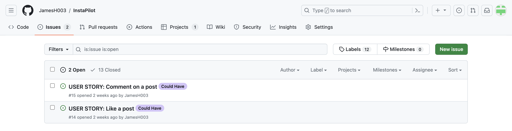

# [INSTAPILOT](https://instapilot-e1ebc8c013f4.herokuapp.com)

Welcome to InstaPilot! InstaPilot is a blog style photo site dedicated to aviation photography. The idea behind InstaPilot is that pilots, aviation enthusiasts and passengers alike can register and upload their photos taken in the air and allow others to enjoy the spectacular views. Users are able to provide a description of each photograph, along with the airline in question, flight number and exact location where each photo was taken. The site is aimed at people of all ages who have an interest in aviation and photography. Users will find the site intuitive and responsive across all devices.


## UX

The concept of the site is very straight forward and I wanted the design to reflect this. The images are laid out on cards in a grid format with a maximum of 12 cards per page. Users can register and then login through separate pages. The home page features a background image of a cloudy sky. 

### Colour Scheme

- `#000` used for primary text.
- `#888` used for primary highlights.

I used [coolors.co](https://coolors.co/3563d8-d1dcf7-000000) to generate my colour palette.


### Typography

- [AR One Sans](https://fonts.google.com/specimen/AR+One+Sans) was used for the primary headers, titles and all secondary text.

- [Font Awesome](https://fontawesome.com) icons were used throughout the site on individual posts.

## User Stories

### New Site Users

- As a new site user, I would like to register an account, so that I can post my own images.
- As a new site user, I would like to post an image, so that I can view my image on the site.
- As a new site user, I would like to add a caption, so that I can add information to my post.
- As a new site user, I would like to add a flight number, so that I can add information to a post.
- As a new site user, I would like to select an airline, so that I can allocate my post to a specific airline.
- As a new site user, I would like to define the location of the image on a map, so that I can add to the user experience.
- As a new site user, I would like to click on an image, so that I can view the full image and information.
- As a new site user, I would like to comment on a post, so that I can provide feedback about the post.
- As a new site user, I would like to like a post, so that I can show this post appeals to me.

### Returning Site Users

- As a returning site user, I would like to login to my account, so that I can view, edit and delete my posts.
- As a returning site user, I would like to logout of my account, so that I can logout and prevent other editing and deleting my posts.
- As a returning site user, I would like to edit my post, so that I can amend my posts as required.
- As a returning site user, I would like to delete a post, so that I can delete unwanted posts.
- As a returning site user, I would like to view a selection of images, so that I can select one to view.
- As a returning site user, I would like to click on an image, so that I can view the full image and information.

### Site Admin

- As a site administrator, I should be able to login to my account, so that I can view, edit and delete posts.
- As a site administrator, I should be able to create, read, update and delete posts, so that I can manage the site content.
- As a site administrator, I should be able to logout of my admin account, so that I can logout and prevent others editing and deleting posts.


## Wireframes

To follow best practice, wireframes were developed for mobile, tablet, and desktop sizes.
I've used [Balsamiq](https://balsamiq.com/wireframes) to design my site wireframes.

### Mobile Wireframes

<details>
<summary> Click here to see the Mobile Wireframes </summary>

Home
  - 

Details
  - 

</details>

### Tablet Wireframes

<details>
<summary> Click here to see the Tablet Wireframes </summary>

Home
  - 

Details
  - 


</details>

### Desktop Wireframes

<details>
<summary> Click here to see the Desktop Wireframes </summary>

Home
  - 

Details
  - 

</details>

## Features

### Existing Features

- **Landing Page**

    - Visitors to the site will first encounter the landing page which is the homepage of the site. The homepage consists of an opaque navbar at the top with a striking logo in the top left corner. Depending on screen size, either navigation links will be visible to the right of the logo or a navigation burger menu. The links will give the user the option of returning to the home page, registering an account or logging into their account. Beneath the navbar features a background image of a cloudy sky with an overlay of a grid of cards. Each card contains an image and some details regarding the image.


- **Registration Page**

    - Users can register an account through the registration page. The registration page can be accessed through the 'Register' link on the navbar. The registration form consists of a form where users can enter a username, email and password.


- **Login Page**

    - Users can access the Login page through the navbar. The Login page features a link for users to register if they haven't done so already. There are also input fields for username and password.


- **Add Post**

    - Registered users have the option to add a post themselves through the 'Add post' link in the navbar. The add post page consists of a form where users can upload an image along with a caption, select an airline, enter a flight number and location where the photo was taken. Alongside the form there is also a leaflet map where users can drop a pin at the precise location where the photo was taken.


- **View Post**

    - Users can click on any of the images to view them. A new page opens up with a larger version of the image on the left with the details beneath it. On the right the leaflet map is displayed with a pin indicating the location the image was taken. If the user is the owner of the post or a superuser, there are two buttons beneath the image on the left giving the user the option to edit the post or to delete the post.


- **Edit Post**

    - On the edit page, users have the option to edit their own posts and click 'Save' at the bottom once finished to save their changes. The edit page consists of the same form as when they uploaded their post initially, with their previous entries already pre-populated.


- **Delete Post**

    - Should a user wish to delete one of their previous posts, they can click the delete button. They will then be presented with a modal requsesting them to confirm they wish to delete that specific post.


- **Logout Page**

    - Users have the option of logging out of their account by clicking the logout button in the navbar. They will be brought to a new page asking them to confirm they wish to logout of their account.


- **Admin Dashboard**

    - The site also features an admin dashboard where admin users can log in and manage the site content.


### Future Features

- Post comments
    - An additional future feature would be where users can leave comments on posts.
- Post likes
    - An additional future feature would be where users can like different posts.


## Tools & Technologies Used

- [HTML](https://en.wikipedia.org/wiki/HTML) used for the main site content.
- [CSS](https://en.wikipedia.org/wiki/CSS) used for the main site design and layout.
- [CSS Flexbox](https://www.w3schools.com/css/css3_flexbox.asp) used for an enhanced responsive layout.
- [JavaScript](https://www.javascript.com) used for user interaction on the site.
- [Python](https://www.python.org) used as the back-end programming language.
- [Git](https://git-scm.com) used for version control. (`git add`, `git commit`, `git push`)
- [GitHub](https://github.com) used for secure online code storage.
- [Gitpod](https://gitpod.io) used as a cloud-based IDE for development.
- [Bootstrap](https://getbootstrap.com) used as the front-end CSS framework for modern responsiveness and pre-built components.
- [Django](https://www.djangoproject.com) used as the Python framework for the site.
- [PostgreSQL](https://www.postgresql.org) used as the relational database management.
- [ElephantSQL](https://www.elephantsql.com) used as the Postgres database.
- [Heroku](https://www.heroku.com) used for hosting the deployed back-end site.
- [Cloudinary](https://cloudinary.com) used for online static file storage.


## Database Design

Entity Relationship Diagrams (ERD) help to visualize database architecture before creating models.
Understanding the relationships between different tables can save time later in the project.


```python
class Upload(models.Model):
    user = models.ForeignKey(User, on_delete=models.CASCADE)
    image = CloudinaryField('image', default='placeholder', null=False, blank=False)
    caption = models.TextField(max_length=100, null=False, blank=False)
    airline = models.ForeignKey(Airline, on_delete=models.SET_NULL, null=True, blank=True)
    flight_number = models.CharField(max_length=10, null=False, blank=False)
    location = models.CharField(max_length=80)
    latitude = models.DecimalField(
        max_digits=9, decimal_places=6, null=False, blank=False)
    longitude = models.DecimalField(
        max_digits=9, decimal_places=6, null=False, blank=False)
    created_on = models.DateTimeField(auto_now_add=True)

    def image_preview(self):
        from django.utils.html import format_html
        return format_html(f"")

    class Meta:
        ordering = ["-created_on"]

    def __str__(self):
        return self.flight_number
```

```python
class Airline(models.Model):
    name = models.CharField(max_length=40, null=False, blank=False)
    identifier = models.CharField(max_length=3, null=False, blank=False)

    class Meta:
        ordering = ["name"]

    def __str__(self):
        return self.name
```


- Table: **Upload**

    | **PK** | **id** (unique) | Type | Notes |
    | --- | --- | --- | --- |
    | **FK** | user | ForeignKey | FK to **User** model |
    | | image | CloudinaryField | |
    | | caption | TextField | |
    | | airline | ForeignKey | |
    | | flight_number | CharField | |
    | | location | CharField | |
    | | latitude | DecimalField | |
    | | longitude | DecimalField | |
    | | created_on | DateTimeField | |

- Table: **Airline**

    | **PK** | **id** (unique) | Type | Notes |
    | --- | --- | --- | --- |
    | | name | CharField | |
    | | identifier | Charfield | |

## Agile Development Process

### GitHub Projects

[GitHub Projects](https://github.com/JamesH003/InstaPilot/projects) served as an Agile tool for this project.
It isn't a specialized tool, but with the right tags and project creation/issue assignments, it can be made to work.

Through it, user stories, issues, and milestone tasks were planned, then tracked on a weekly basis using the basic Kanban board.


### GitHub Issues

[GitHub Issues](https://github.com/JamesH003/InstaPilot/issues) served as an another Agile tool.
There, I used my own **User Story Template** to manage user stories.

It also helped with milestone iterations on a weekly basis.

- [Open Issues](https://github.com/JamesH003/InstaPilot/issues)

    

- [Closed Issues](https://github.com/JamesH003/InstaPilot/issues?q=is%3Aissue+is%3Aclosed)

    

### MoSCoW Prioritization

I've decomposed my Epics into stories prior to prioritizing and implementing them.
Using this approach, I was able to apply the MoSCow prioritization and labels to my user stories within the Issues tab.

- **Must Have**: guaranteed to be delivered (*max 60% of stories*)
- **Should Have**: adds significant value, but not vital (*the rest ~20% of stories*)
- **Could Have**: has small impact if left out (*20% of stories*)
- **Won't Have**: not a priority for this iteration

## Testing

For all testing, please refer to the [TESTING.md](TESTING.md) file.

## Deployment

The live deployed application can be found deployed on [Heroku](https://instapilot-e1ebc8c013f4.herokuapp.com).

### ElephantSQL Database

This project uses [ElephantSQL](https://www.elephantsql.com) for the PostgreSQL Database.

To obtain your own Postgres Database, sign-up with your GitHub account, then follow these steps:

- Click **Create New Instance** to start a new database.
- Provide a name (this is commonly the name of the project: InstaPilot).
- Select the **Tiny Turtle (Free)** plan.
- You can leave the **Tags** blank.
- Select the **Region** and **Data Center** closest to you.
- Once created, click on the new database name, where you can view the database URL and Password.

### Cloudinary API

This project uses the [Cloudinary API](https://cloudinary.com) to store media assets online, due to the fact that Heroku doesn't persist this type of data.

To obtain your own Cloudinary API key, create an account and log in.

- For *Primary interest*, you can choose *Programmable Media for image and video API*.
- Optional: *edit your assigned cloud name to something more memorable*.
- On your Cloudinary Dashboard, you can copy your **API Environment Variable**.
- Be sure to remove the `CLOUDINARY_URL=` as part of the API **value**; this is the **key**.

### Heroku Deployment

This project uses [Heroku](https://www.heroku.com), a platform as a service (PaaS) that enables developers to build, run, and operate applications entirely in the cloud.

Deployment steps are as follows, after account setup:

- Select **New** in the top-right corner of your Heroku Dashboard, and select **Create new app** from the dropdown menu.
- Your app name must be unique, and then choose a region closest to you (EU or USA), and finally, select **Create App**.
- From the new app **Settings**, click **Reveal Config Vars**, and set your environment variables.

| Key | Value |
| --- | --- |
| `CLOUDINARY_URL` | user's own value |
| `DATABASE_URL` | user's own value |
| `DISABLE_COLLECTSTATIC` | 1 (*this is temporary, and can be removed for the final deployment*) |
| `SECRET_KEY` | user's own value |

Heroku needs two additional files in order to deploy properly.

- requirements.txt
- Procfile

You can install this project's **requirements** (where applicable) using:

- `pip3 install -r requirements.txt`

If you have your own packages that have been installed, then the requirements file needs updated using:

- `pip3 freeze --local > requirements.txt`

The **Procfile** can be created with the following command:

- `echo web: gunicorn app_name.wsgi > Procfile`
- *replace **app_name** with the name of your primary Django app name; the folder where settings.py is located*

For Heroku deployment, follow these steps to connect your own GitHub repository to the newly created app:

Either:

- Select **Automatic Deployment** from the Heroku app.

Or:

- In the Terminal/CLI, connect to Heroku using this command: `heroku login -i`
- Set the remote for Heroku: `heroku git:remote -a app_name` (replace *app_name* with your app name)
- After performing the standard Git `add`, `commit`, and `push` to GitHub, you can now type:
	- `git push heroku main`

The project should now be connected and deployed to Heroku!

### Local Deployment

This project can be cloned or forked in order to make a local copy on your own system.

For either method, you will need to install any applicable packages found within the *requirements.txt* file.

- `pip3 install -r requirements.txt`.

You will need to create a new file called `env.py` at the root-level,
and include the same environment variables listed above from the Heroku deployment steps.

Sample `env.py` file:

```python
import os

os.environ.setdefault("CLOUDINARY_URL", "user's own value")
os.environ.setdefault("DATABASE_URL", "user's own value")
os.environ.setdefault("SECRET_KEY", "user's own value")

# local environment only (do not include these in production/deployment!)
os.environ.setdefault("DEBUG", "True")
```

Once the project is cloned or forked, in order to run it locally, you'll need to follow these steps:

- Start the Django app: `python3 manage.py runserver`
- Stop the app once it's loaded: `CTRL+C` or `⌘+C` (Mac)
- Make any necessary migrations: `python3 manage.py makemigrations`
- Migrate the data to the database: `python3 manage.py migrate`
- Create a superuser: `python3 manage.py createsuperuser`
- Load fixtures (if applicable): `python3 manage.py loaddata file-name.json` (repeat for each file)
- Everything should be ready now, so run the Django app again: `python3 manage.py runserver`

#### Cloning

You can clone the repository by following these steps:

1. Go to the [GitHub repository](https://github.com/JamesH003/InstaPilot) 
2. Locate the Code button above the list of files and click it 
3. Select if you prefer to clone using HTTPS, SSH, or GitHub CLI and click the copy button to copy the URL to your clipboard
4. Open Git Bash or Terminal
5. Change the current working directory to the one where you want the cloned directory
6. In your IDE Terminal, type the following command to clone my repository:
	- `git clone https://github.com/JamesH003/InstaPilot.git`
7. Press Enter to create your local clone.

Alternatively, if using Gitpod, you can click below to create your own workspace using this repository.

[](https://gitpod.io/#https://github.com/JamesH003/InstaPilot)

Please note that in order to directly open the project in Gitpod, you need to have the browser extension installed.
A tutorial on how to do that can be found [here](https://www.gitpod.io/docs/configure/user-settings/browser-extension).

#### Forking

By forking the GitHub Repository, we make a copy of the original repository on our GitHub account to view and/or make changes without affecting the original owner's repository.
You can fork this repository by using the following steps:

1. Log in to GitHub and locate the [GitHub Repository](https://github.com/JamesH003/InstaPilot)
2. At the top of the Repository (not top of page) just above the "Settings" Button on the menu, locate the "Fork" Button.
3. Once clicked, you should now have a copy of the original repository in your own GitHub account!

### Local VS Deployment

I have not noticed any differences between the local version and the live deployment of the site on Heroku.

## Credits

### Content

| Source | Location | Notes |
| --- | --- | --- |
| [Markdown Builder](https://tim.2bn.dev/markdown-builder) | README and TESTING | tool to help generate the Markdown files |
| [Flexbox Froggy](https://flexboxfroggy.com/) | entire site | modern responsive layouts |
| [W3Schools](https://www.w3schools.com/cssref/css3_pr_text-shadow.php) | navbar | text-shadow |
| [W3Schools](https://www.w3schools.com/tags/att_form_enctype.asp) | forms | HTML <form> enctype Attribute |
| [W3Schools](https://www.w3schools.com/html/html_favicon.asp) | favicon | favicon |
| [WhiteNoise](http://whitenoise.evans.io) | entire site | hosting static files on Heroku temporarily |
| [Bootstrap](https://getbootstrap.com/docs/5.3/customize/overview/) | entire site | responsive layouts |


### Media

| Source | Location | Type | Notes |
| --- | --- | --- | --- |
| [Pexels](https://www.pexels.com/photo/blue-skies-53594/) | entire site | image | cloudy sky background image |
| [Pexels](https://www.pexels.com/photo/silhouette-of-airplane-1577238/) | placeholder | image | plane in sky |
| [PNG EGG](https://www.pngegg.com/en/png-zwtrp) | favicon | image | cloud |
| [TinyPNG](https://tinypng.com) | favicon | image | tool for image compression |
| [FontAwesome](https://fontawesome.com/icons/user?f=classic&s=solid) | caption | icon | user icon |
| [FontAwesome](https://fontawesome.com/icons/plane?f=classic&s=solid) | caption | icon | plane icon |
| [FontAwesome](https://fontawesome.com/icons/location-dot?f=classic&s=solid) | caption | icon | map-marker icon |
| [csvjson](https://csvjson.com/csv2json) | airlines.json | csv conversion | converted csv file to json |
| [draw.io](https://app.diagrams.net/?src=about) | README | screenshot | ERD diagram |


### Acknowledgements

- I would like to thank my Code Institute mentor, [Tim Nelson](https://github.com/TravelTimN) for their support throughout the development of this project.
- I would like to thank the [Code Institute](https://codeinstitute.net) tutor team for their assistance with troubleshooting and debugging some project issues.
- I would like to thank the [Code Institute Slack community](https://code-institute-room.slack.com) for the moral support; it kept me going during periods of self doubt and imposter syndrome.
- I would like to thank my partner Caoimhe, for continuing to support me throughout this course.
