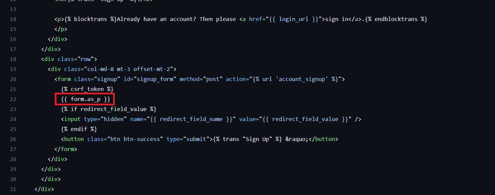
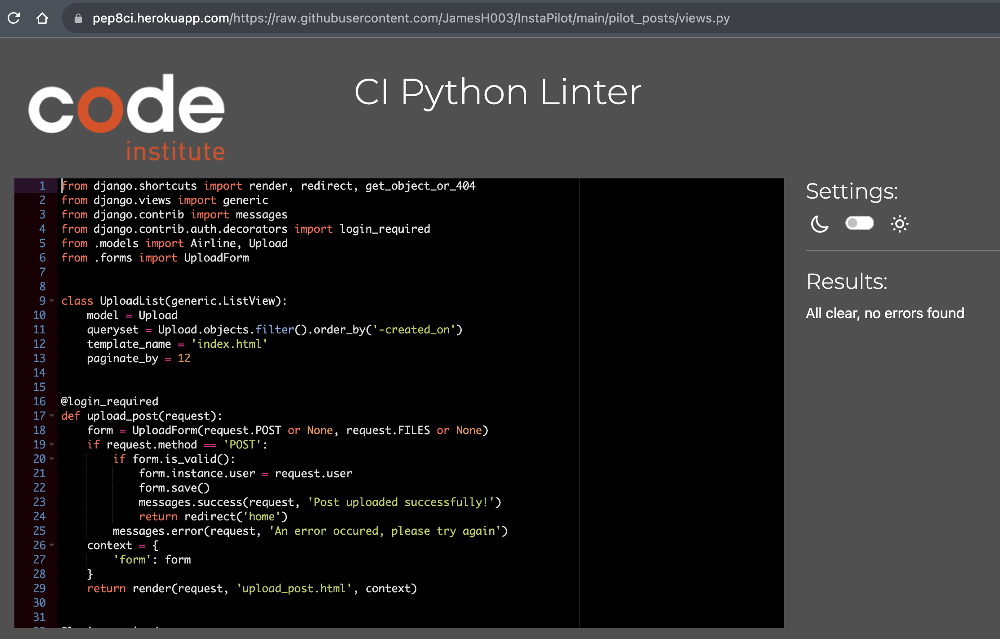
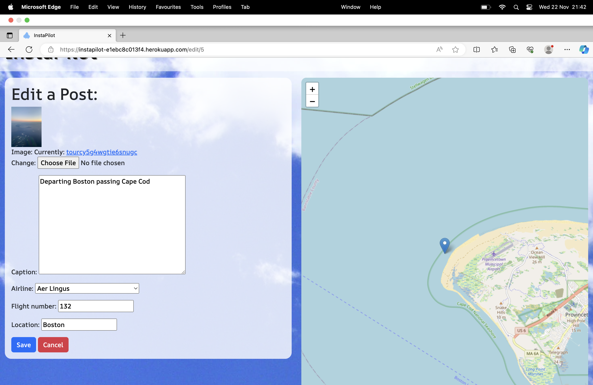
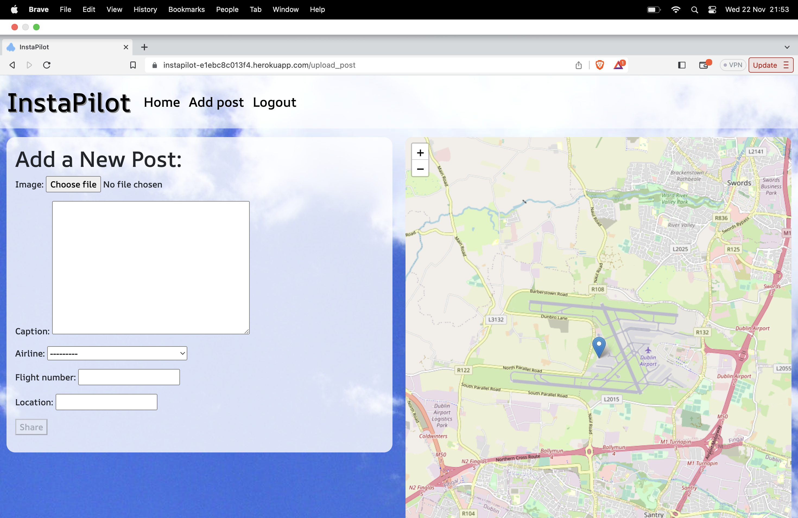
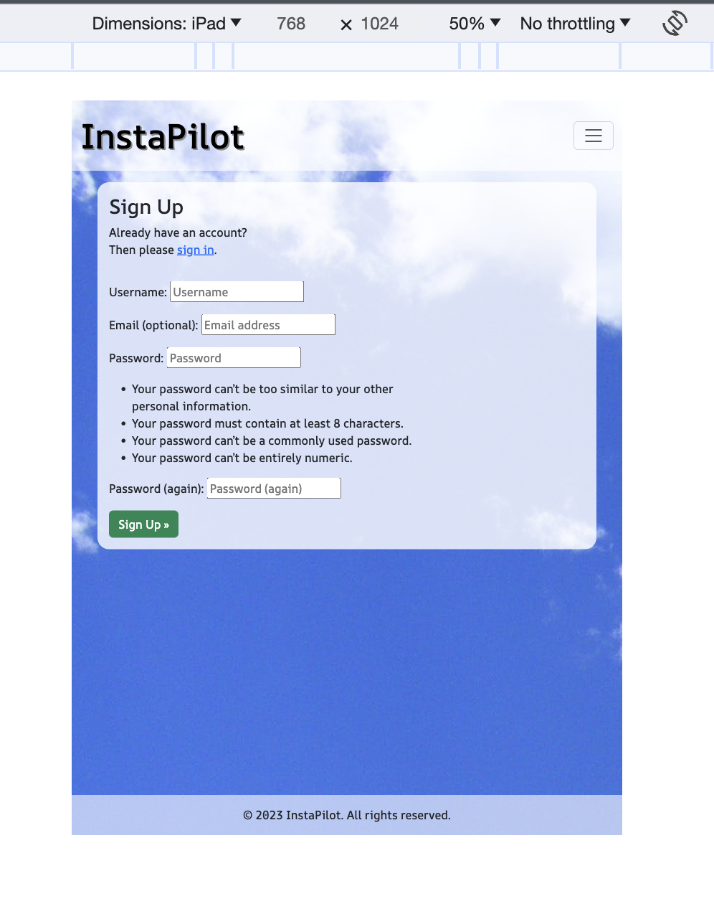
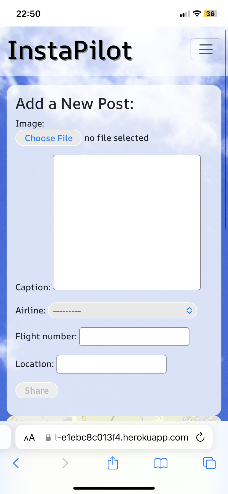

# Testing

Return back to the [README.md](README.md) file.

## Code Validation

### HTML

I have used the recommended [HTML W3C Validator](https://validator.w3.org) to validate all of my HTML files.

| Page | W3C URL | Screenshot | Notes |
| --- | --- | --- | --- |
| Home | [W3C](https://validator.w3.org/nu/?doc=https%3A%2F%2Finstapilot-e1ebc8c013f4.herokuapp.com%2F) |  | Pass: No Errors |
| Register | [W3C](https://validator.w3.org/nu/?doc=https%3A%2F%2Finstapilot-e1ebc8c013f4.herokuapp.com%2Faccounts%2Fsignup%2F) |    | Extra < p > and < /p > in the {{ form.as_p }} of the Allauth signup.html template |
| Login | [W3C](https://validator.w3.org/nu/?doc=https%3A%2F%2Finstapilot-e1ebc8c013f4.herokuapp.com%2Faccounts%2Flogin%2F) |  | Pass: No Errors |
| Upload Post | [W3C](https://validator.w3.org/nu/?doc=https%3A%2F%2Finstapilot-e1ebc8c013f4.herokuapp.com%2Fupload_post) |  | Pass: No Errors |
| Details | [W3C](https://validator.w3.org/nu/?doc=https%3A%2F%2Finstapilot-e1ebc8c013f4.herokuapp.com%2Fdetails%2F13) |  | Pass: No Errors |
| Edit | [W3C](https://validator.w3.org/nu/?doc=https%3A%2F%2Finstapilot-e1ebc8c013f4.herokuapp.com%2F) |  | Pass: No Errors |
| Logout | [W3C](https://validator.w3.org/nu/?doc=https%3A%2F%2Finstapilot-e1ebc8c013f4.herokuapp.com%2F) |  | Pass: No Errors |

### CSS

I have used the recommended [CSS Jigsaw Validator](https://jigsaw.w3.org/css-validator) to validate all of my CSS files.

| File | Jigsaw URL | Screenshot | Notes |
| --- | --- | --- | --- |
| live site | [Jigsaw](https://jigsaw.w3.org/css-validator/validator?uri=https%3A%2F%2Finstapilot-e1ebc8c013f4.herokuapp.com%2F&profile=css3svg&usermedium=all&warning=1&vextwarning=&lang=en#errors) |  | Warnings and Errors relate to Bootstrap, FontAwesome and Leaflet |
| style.css | [Jigsaw](https://jigsaw.w3.org/css-validator/validator) |  | Pass: No Errors |

### JavaScript

I have used the recommended [JShint Validator](https://jshint.com) to validate all of my JS files.

| File | Screenshot | Notes |
| --- | --- | --- |
| base.html |  | Pass: No Errors |
| edit_upload.html |  | Pass: No Errors |
| upload_details.html |  | Five warnings related to django code |
| upload_post.html |  | Pass: No Errors |

### Python

I have used the recommended [PEP8 CI Python Linter](https://pep8ci.herokuapp.com) to validate all of my Python files.

| File | CI URL | Screenshot | Notes |
| --- | --- | --- | --- |
| settings.py | [PEP8 CI](https://pep8ci.herokuapp.com/https://raw.githubusercontent.com/JamesH003/InstaPilot/main/main/settings.py) |  | Pass: No Errors |
| urls.py (main) | [PEP8 CI](https://pep8ci.herokuapp.com/https://raw.githubusercontent.com/JamesH003/InstaPilot/main/main/urls.py) |  | Pass: No Errors |
| admin.py | [PEP8 CI](https://pep8ci.herokuapp.com/https://raw.githubusercontent.com/JamesH003/InstaPilot/main/pilot_posts/admin.py) |  | Pass: No Errors |
| apps.py | [PEP8 CI](https://pep8ci.herokuapp.com/https://raw.githubusercontent.com/JamesH003/InstaPilot/main/pilot_posts/apps.py) |  | Pass: No Errors |
| forms.py | [PEP8 CI](https://pep8ci.herokuapp.com/https://raw.githubusercontent.com/JamesH003/InstaPilot/main/pilot_posts/forms.py) |  | Pass: No Errors |
| models.py | [PEP8 CI](https://pep8ci.herokuapp.com/https://raw.githubusercontent.com/JamesH003/InstaPilot/main/pilot_posts/models.py) |  | Pass: No Errors |
| urls.py (pilot_posts) | [PEP8 CI](https://pep8ci.herokuapp.com/https://raw.githubusercontent.com/JamesH003/InstaPilot/main/pilot_posts/urls.py) |  | Pass: No Errors |
| views.py | [PEP8 CI](https://pep8ci.herokuapp.com/https://raw.githubusercontent.com/JamesH003/InstaPilot/main/pilot_posts/views.py) |  | Pass: No Errors |
| manage.py | [PEP8 CI](https://pep8ci.herokuapp.com/https://raw.githubusercontent.com/JamesH003/InstaPilot/main/manage.py) |  | Pass: No Errors |

## Browser Compatibility

I've tested my deployed project on multiple browsers to check for compatibility issues.

| Browser | Home | Register | Add post | Edit post | Delete post |
| --- | --- | --- | --- | --- | --- |
| Chrome |  |  |  |  |  | Works as expected |
| Firefox |  |  |  |  |  | Works as expected |
| Edge |  |  |  |  |  | Works as expected |
| Safari |  |  |  |  |  | Works as expected |
| Brave |  |  |  |  |  | Works as expected |
| Opera |  |  |  |  |  | Works as expected |

## Responsiveness

I've tested my deployed project on multiple devices to check for responsiveness issues.

| Device | Home | Register | Add post | Edit post | Notes |
| --- | --- | --- | --- | --- | --- |
| Mobile (DevTools) |  |  |  |  | Works as expected |
| Tablet (DevTools) |  |  |  |  | Works as expected |
| Desktop |  |  |  |  | Works as expected |
| iPhone 11 |  |  |  |  | Works as expected |

## Lighthouse Audit

I've tested my deployed project using the Lighthouse Audit tool to check for any major issues.

| Page | Mobile | Desktop | Notes |
| --- | --- | --- | --- |
| Home |  |  | Some minor warnings |
| Register |  |  | Some minor warnings |
| Add post |  |  | Some minor warnings |
| Edit post |  |  | Some minor warnings |

## Defensive Programming

Defensive programming was manually tested with the below user acceptance testing:

| Page | Expectation | Test | Result | Fix | Screenshot |
| --- | --- | --- | --- | --- | --- |
| Home | | | | | |
| | From the home page a user should be able to view the images, but not edit or delete them, unless the user is logged in and the image belongs to them or is a superuser | Tested the feature by remaining logged out and clicking on an image | The feature behaved as expected, and neither the edit or delete options were displayed | Test concluded and passed |  |
| | From the home page a user should not be able to brute-force a URL to navigate to a restricted page | Tested the feature by remaining logged out and typing '/edit/13' at the end of the site url (https://instapilot-e1ebc8c013f4.herokuapp.com/edit/13) | The feature behaved as expected, and access was denied | Test concluded and passed |  |
| Register | | | | | |
| | Registration form is expected to require a username be entered | Tested the feature by leaving the field blank | The feature behaved as expected, and requested a username be entered | Test concluded and passed |  |
| | Registration form is expected to request a different username if the one entered is already in use | Tested the feature by entering a username already in use | The feature behaved as expected, and requested a different username be entered | Test concluded and passed |  |
| Login | | | | | |
| | The login form is expected to only grant access with a correct username and password combination | Tested the feature by entering an incorrect password | The feature behaved as expected, and it did not grant me access | Test concluded and passed |  |
| Add post | | | | | |
| | Add post form is expected to require a caption | Tested the feature by not entering a caption | The feature behaved as expected, and it requested a caption be entered | Test concluded and passed |  |
| | Add post form is expected to require a flight number | Tested the feature by not entering a flight number | The feature behaved as expected, and it requested a flight number be entered | Test concluded and passed |  |
| | Add post form is expected to require a location | Tested the feature by not entering a location | The feature behaved as expected, and it requested a location be entered | Test concluded and passed |  |
| | Add post form is expected to require a location be set on the map | Tested the feature by not entering a location | The feature behaved as expected, and didn't allow the share button be clicked | Test concluded and passed |  |
| Delete modal | | | | | |
| | Details page is expected to prompt the user to confirm they wish to delete their image before deleting it | Tested the feature by clicking delete on an image | The feature behaved as expected, and a modal appeared requesting the user to confirm they wish to delete the image | Test concluded and passed |  |

## User Story Testing

| User Story | Screenshot |
| --- | --- |
| As a new site user, I would like to register an account, so that I can post my own images. |  |
| As a new site user, I would like to post an image, so that I can view my image on the site. |  |
| As a new site user, I would like to add a caption, flight number, airline and location so that I can add information to my post.️ |  |
| As a new site user, I would like to click on an image, so that I can view the full image and information. |  |
| As a returning site user, I would like to login to my account, so that I can view, edit and delete my posts. |  |
| As a returning site user, I would like to logout of my account, so that I can logout and prevent others editing and deleting my posts. |  |
| As a returning site user, I would like to edit my post, so that I can amend my posts as required. |  |
| As a returning site user, I would like to delete a post, so that I can delete unwanted posts. |  |
| As a site administrator, I should be able to login to my account, so that I can view, edit and delete posts. |  |

## Bugs

- Background image not displaying on deployed site through Heroku

    

    - I originally had my css code as per the screenshot above. To fix this, I contacted tutor support and was advised by a tutor to hard-code the URL. Although this isn't an ideal solution, it got the job done. I intend to revisit this when I have more time to do it properly.

    

- Python `E501 line too long`

    

    - To fix this, I hit return after the open bracket on lines 19 & 22.

- Background image not extending the full length of the content on smaller screens

    

    - To fix this, I added a media query in style.css with a min-width value of 780px and removed the no-repeat attribute from the background image.

    

## Unfixed Bugs

There are no remaining bugs that I am aware of.
